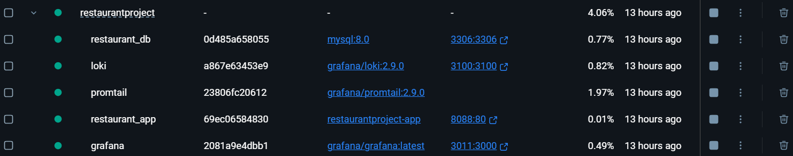
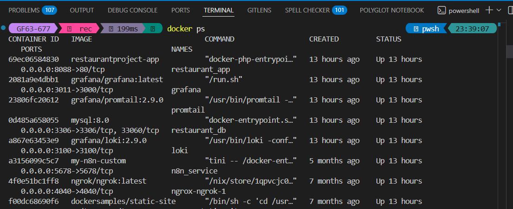
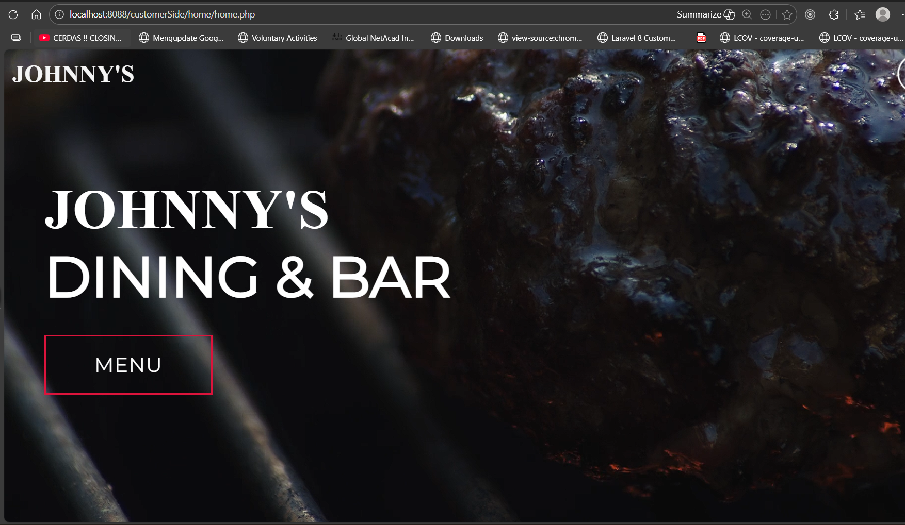
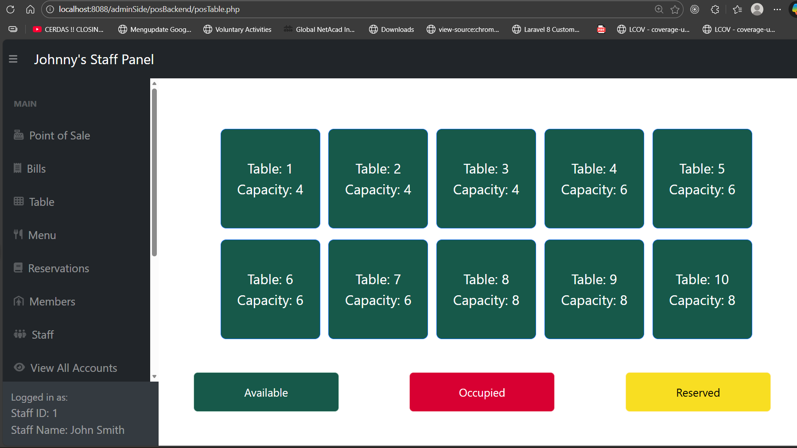
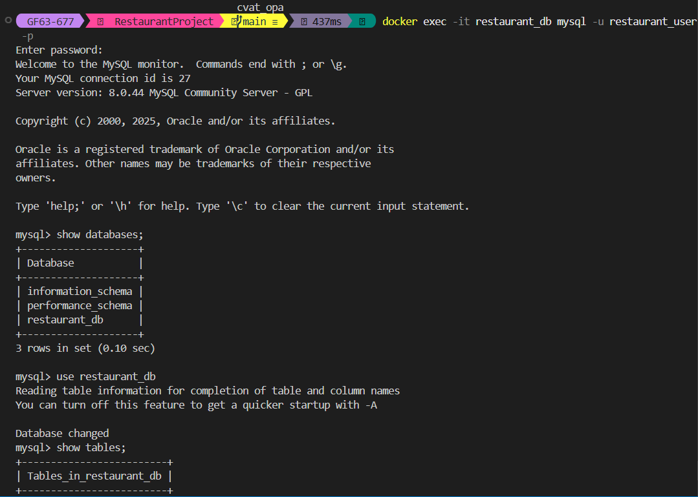
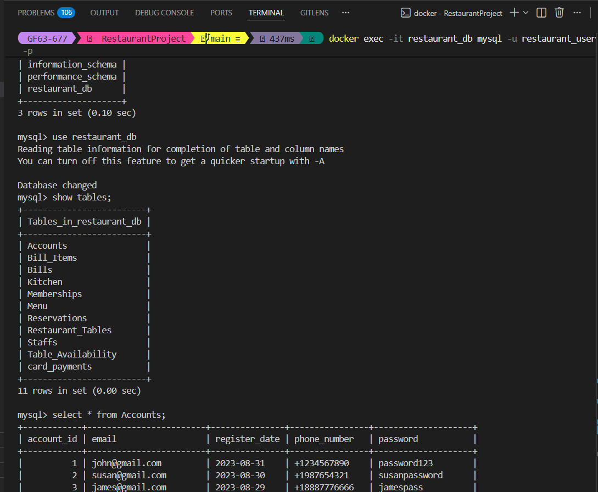
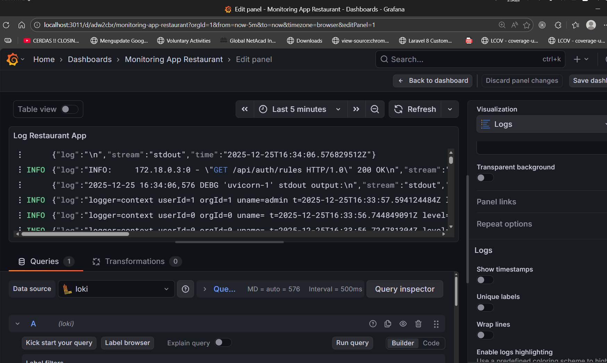

## 📦 Submission Deliverables

This submission includes a complete deployment package that fulfills all assessment requirements.  
The following components and evidences are provided:

---

### 📘 Documentation

- **Detailed README.md**  
  Contains complete setup, configuration, and execution instructions, including:
  - Prerequisites
  - Environment configuration
  - Build and run steps using Docker Compose
  - Application access and validation
  - Monitoring and logging setup
  - Troubleshooting guidelines

---

### 📸 Screenshots Evidence

The following screenshots are included as proof of successful deployment and execution:

- **Running Docker Containers**  
  Evidence showing all required containers running successfully using `docker ps`.

    
    

- **Application Interface**  
  Browser access to the Restaurant application running on port 8088.
    
    

- **Database Terminal**  
  Successful connection to the MySQL database using the application user and validation of database tables.
    
    

- **Grafana Dashboard**  
  Grafana interface displaying application logs and/or monitoring data via Loki.
    
    

---

### 📑 Deployment Report (PDF / Presentation)

A final deployment report is provided in **PDF and/or presentation format**, summarizing the following:

- **Setup Steps**  
  Overview of the deployment flow from repository cloning to application runtime.

- **Configuration Details**  
  Explanation of Dockerfile, Docker Compose services, environment variables, and network setup.

- **Monitoring Implementation**  
  Description of Grafana, Loki, and Promtail integration for centralized logging and monitoring.

- **Issues Encountered and Resolutions**  
  Summary of technical issues faced during deployment and the solutions applied.

---

All deliverables are organized, accessible, and fully functional as required for assessment review.
